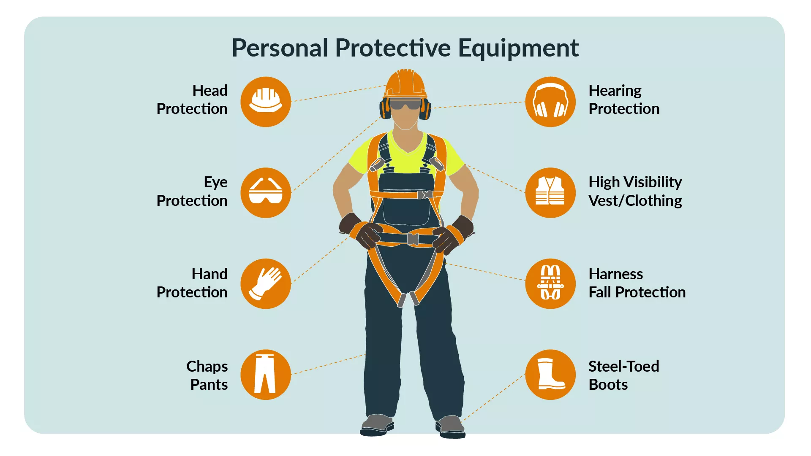
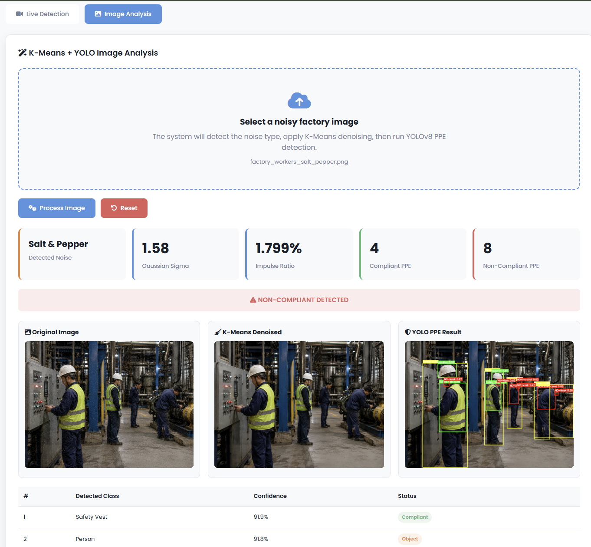

# MERSAD — PPE Detection and Image Denoising System

MERSAD is an industrial safety monitoring system that combines automatic image denoising with YOLOv8-based personal protective equipment (PPE) detection.

The system supports both live camera detection and uploaded-image analysis. For uploaded images, the application automatically estimates the noise type, applies a K-Means-based denoising pipeline, and then sends the cleaned image directly to YOLOv8 for PPE detection.

## Key Features

- Live PPE detection using a webcam.
- Upload and analyze factory images through a Flask web interface.
- Automatic noise classification:
  - Gaussian noise
  - Salt-and-pepper noise
  - Mixed noise
  - Clean image
- K-Means-based image denoising.
- YOLOv8 PPE detection after preprocessing.
- Green bounding boxes for compliant PPE classes.
- Red bounding boxes for non-compliant PPE classes.
- Detection statistics and recent alerts.
- Snapshot storage and instance review.
- SQLite database for detection records.

## Detected Classes

The trained YOLOv8 model supports the following classes:


| ID | Class |
|---:|---|
| 0 | Hardhat |
| 1 | Mask |
| 2 | NO-Hardhat |
| 3 | NO-Mask |
| 4 | NO-Safety Vest |
| 5 | Person |
| 6 | Safety Cone |
| 7 | Safety Vest |
| 8 | Machinery |
| 9 | Vehicle |

## Compliance Logic

The system treats the following classes as compliant PPE:

- `Hardhat`
- `Mask`
- `Safety Vest`

The following classes indicate non-compliance:

- `NO-Hardhat`
- `NO-Mask`
- `NO-Safety Vest`

A red warning is shown when one or more non-compliant PPE classes are detected.

> The non-compliant PPE count represents detected violation boxes, not necessarily the number of unique workers. One worker may have multiple violations.

## Image Processing Pipeline

Uploaded images follow this workflow:

```text
Uploaded Image
      |
      v
Automatic Noise Estimation
      |
      v
K-Means Denoising
      |
      v
YOLOv8 PPE Detection
      |
      v
Annotated Result and Compliance Summary
```

### Salt-and-Pepper Noise

K-Means is used to cluster local pixel-outlier features and identify probable impulse-noise pixels. Only the detected pixels are replaced using a selective median-filtering step.

### Gaussian Noise

The image is divided into overlapping patches. K-Means groups structurally similar patches, then PCA-Wiener shrinkage is applied within each cluster to suppress Gaussian noise while preserving image structure.

### Mixed Noise

The system first removes salt-and-pepper noise, then applies the Gaussian-noise removal stage.

## Web Interface

The main interface includes two modes:

### Live Detection

- Starts the computer webcam.
- Runs YOLOv8 on live frames.
- Shows compliance status.
- Saves snapshots of detected instances.
- Updates statistics and alerts.

### Image Analysis

- Uploads PNG, JPG, JPEG, or WEBP images.
- Detects the noise type automatically.
- Displays:
  - Original image
  - K-Means-denoised image
  - YOLO PPE result
- Shows:
  - Detected noise type
  - Estimated Gaussian sigma
  - Impulse-noise ratio
  - Compliant detections
  - Non-compliant detections
  - Per-object confidence scores

## Project Structure

```text
Construction-Site-Safety-PPE-Detection/
│
├── Model-Deployment/
│   ├── app.py
│   ├── database.py
│   ├── detection_logic.py
│   ├── kmeans_auto_denoising.py
│   ├── kmeans_yolo_pipeline.py
│   ├── detections.db
│   ├── settings.json
│   │
│   ├── templates/
│   │   ├── index.html
│   │   ├── review.html
│   │   └── settings.html
│   │
│   ├── static/
│   │   ├── uploads/
│   │   └── results/
│   │
│   ├── snapshots/
│   └── runs/
│
├── Model-Testing/
│
├── Model-Training/
│   └── Outputs/
│       └── runs/
│           └── detect/
│               └── yolov8s_ppe_css_200_epochs/
│                   └── weights/
│                       ├── best.pt
│                       └── last.pt
│
├── result.png
└── README.md
```

## Results

The system was tested on noisy industrial images containing workers with different PPE compliance conditions.

The example below shows the final output after K-Means denoising and YOLOv8 PPE detection.



The model detected compliant equipment such as hardhats and safety vests, as well as violations including `NO-Hardhat`, `NO-Mask`, and `NO-Safety Vest`.

The non-compliant value represents the number of detected violation boxes rather than the number of unique workers, since one worker may have multiple PPE violations.
